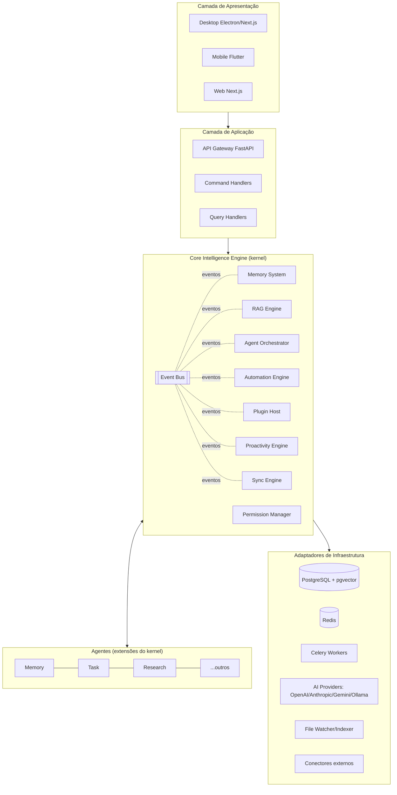
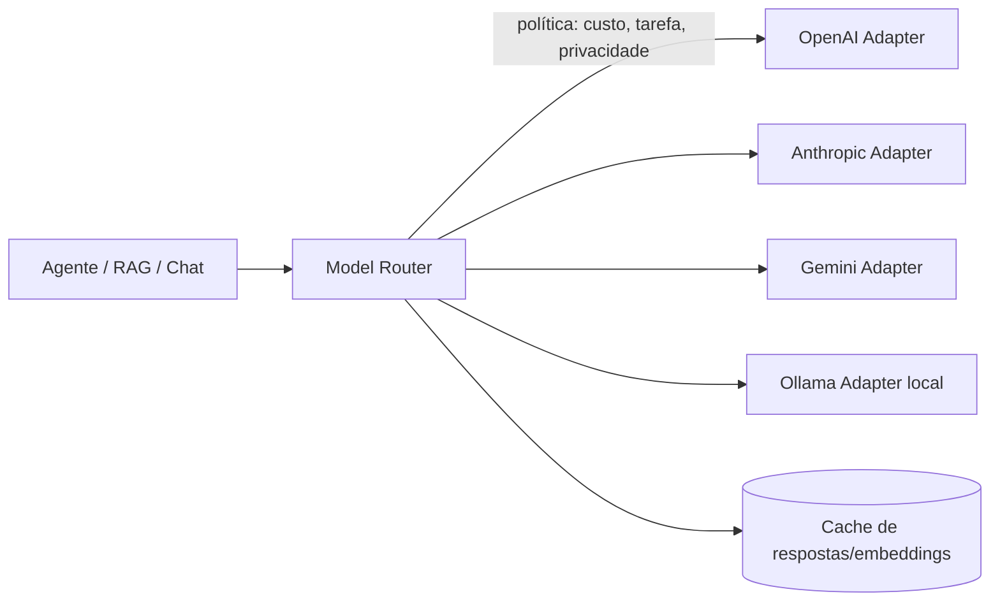
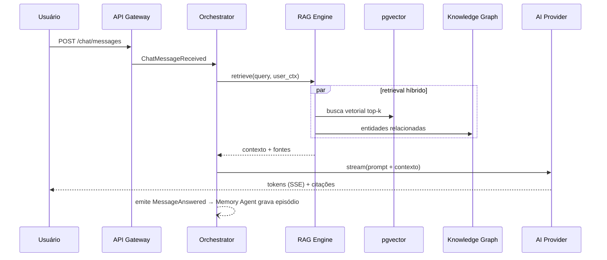

# 04 — Arquitetura

## Estilo arquitetural

Combinação deliberada (justificativas no doc 20):

- **Microkernel**: o Core Intelligence Engine é o kernel; tudo mais (agentes, módulos de vida, plugins) são extensões registráveis.
- **Event-Driven**: nenhum módulo chama outro diretamente; toda comunicação passa pelo Event Bus.
- **Hexagonal (Ports & Adapters)**: domínio puro no centro; IA, banco, vetores, arquivos e nuvem são adaptadores atrás de ports.
- **Clean Architecture + DDD**: dependências apontam para dentro; bounded contexts no doc 09.
- **CQRS seletivo**: apenas onde leitura e escrita divergem de verdade (busca semântica, timeline, dashboard).
- **Local-first**: o desktop roda o stack completo; a nuvem é um par de sincronização, não o dono dos dados.

## Visão em camadas



## Core Intelligence Engine

Responsabilidades do kernel — e apenas estas:

| Subsistema | Responsabilidade | Port principal |
|---|---|---|
| Event Bus | Pub/sub tipado, entrega at-least-once, DLQ, replay | `EventBusPort` |
| Memory System | 5 memórias, consolidação, embeddings, esquecimento | `MemoryPort`, `VectorStorePort` |
| RAG Engine | Chunking, retrieval híbrido (vetorial+BM25+grafo), re-ranking, citações | `RetrieverPort` |
| Agent Orchestrator | Registro, ciclo de vida, roteamento de tarefas, supervisão de agentes | `AgentRegistryPort` |
| Automation Engine | Interpretação e execução de fluxos, retry, logs por passo | `WorkflowPort` |
| Plugin Host | Carregamento, sandbox, manifesto de permissões, API mediada | `PluginHostPort` |
| Permission Manager | Consentimento granular por recurso/fonte/ação | `PermissionPort` |
| Sync Engine | Log de operações, CRDT/LWW, reconciliação E2E-criptografada | `SyncPort` |
| Proactivity Engine | Regras + IA sobre sinais autorizados → sugestões explicáveis | `InsightPort` |
| AI Abstraction | Roteamento de modelos, streaming, fallback, orçamento de tokens | `AIProviderPort` |

Regra de ouro: **módulos nunca importam módulos**. Importam ports do kernel e reagem a eventos.

## Camada de abstração de IA



Contrato único (`AIProviderPort`): `complete()`, `stream()`, `embed()`, `transcribe()`, `vision()`. Política de roteamento declarativa: dados sensíveis podem ser fixados em `local_only`. Trocar de provedor é configuração, não código.

## Fluxo típico: pergunta com RAG



## Topologia de execução

**Desktop (offline-first):** um único pacote Electron embarca o backend Python (sidecar), PostgreSQL embutido (ou SQLite+sqlite-vec no modo lite — ADR-007), Redis embutido (ou fila in-process) e Ollama opcional. **Cloud:** os mesmos serviços em contêineres, atrás de gateway, para web, sync e mobile. O código de domínio é idêntico nos dois; apenas os adaptadores mudam — é isso que a arquitetura hexagonal compra.

## Estrutura do monorepo (alvo)

```
lumbra/
├── apps/                     # (futuro) desktop Electron, mobile Flutter, web
├── src/lumbra/                # distribuição Python única (ADR-013)
│   ├── shared/               # config, logging, ids — transversal
│   ├── domain/               # entidades, agregados, eventos (puro, sem I/O)
│   ├── application/          # use cases, command/query handlers
│   ├── ports/                # interfaces (hexagonal)
│   ├── kernel/               # Core Intelligence Engine: bus, orchestrator, plugin host
│   ├── adapters/             # infra: pg, redis, ai providers, fs, ocr...
│   ├── agents/               # um subpacote por agente
│   └── api/                  # FastAPI (camada fina)
├── tests/                    # unit, api, integration
├── docker/                   # Do