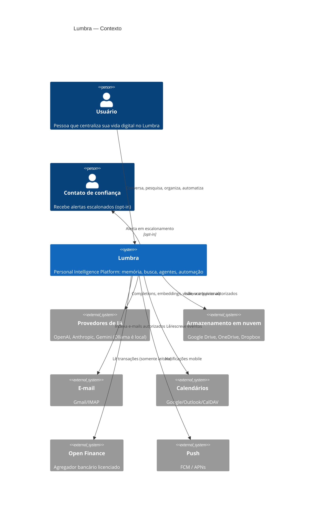
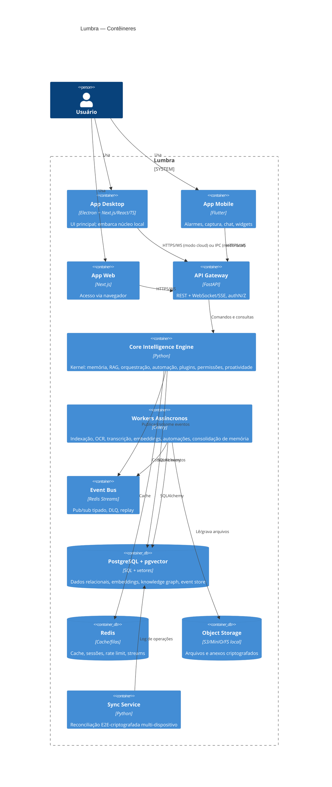
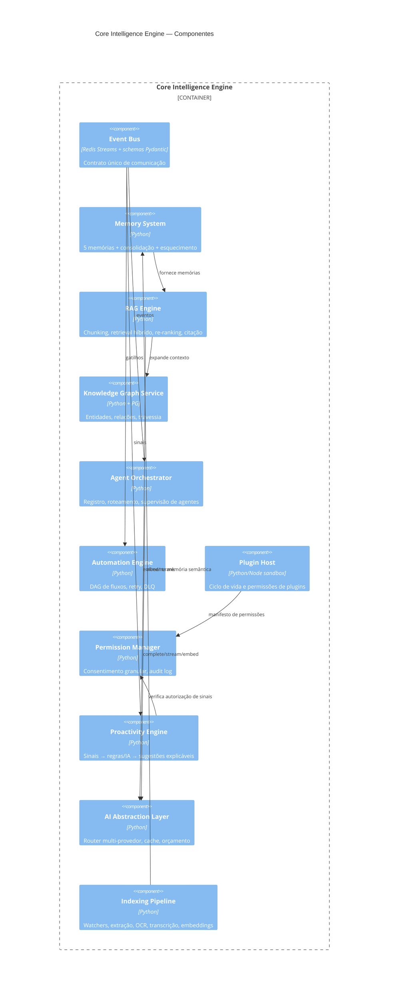
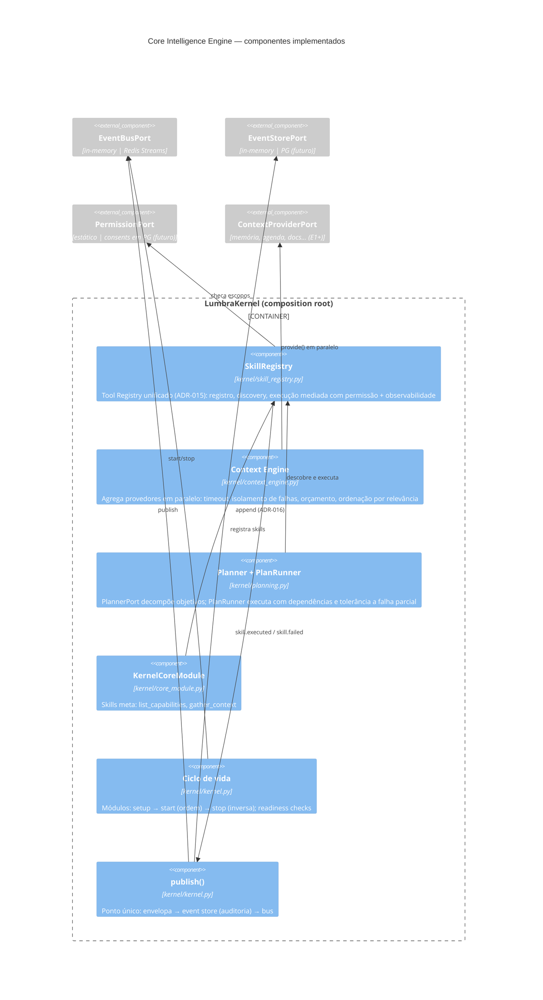
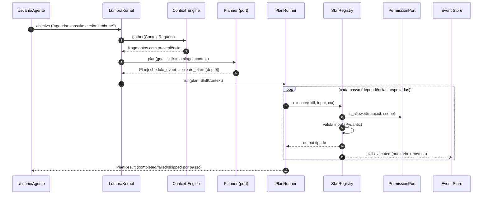
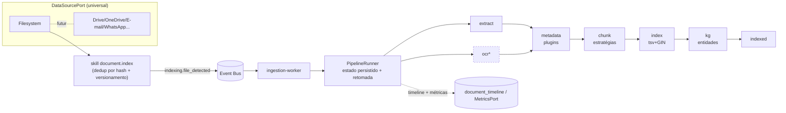

# 05 — Diagramas C4

## Nível 1 — Contexto

## Nível 2 — Contêineres

## Nível 3 — Componentes do Core Intelligence Engine

## Nível 3 (v2, Etapa 3) — Core Intelligence Engine implementado

Estado real do kernel após a Etapa 3 (`src/lumbra/kernel/`):

## Fluxo dos agentes — objetivo complexo (Etapa 3)

Como isso suporta o futuro: um **novo agente** = um `LumbraModule` que registra skills e consumidores — nada mais muda; um **plugin** = mesmo contrato via Plugin Host (Beta), com manifesto de permissões negado por padrão no `PermissionPort`; uma **nova integração** (agenda, e-mail...) = um `ContextProviderPort` + skills (`schedule_event`, `send_email`) que o Planner passa a usar automaticamente via discovery — nenhum código existente é alterado.

## Pipeline de ingestão (E1 Etapa 2) — componentes e fluxo

*ocr: estágio registrado; provider concreto plugável via `OCRProviderPort`.

**Como crescer sem mudanças estruturais:** nova fonte (Drive, e-mail, WhatsApp) = 1 adapter de `DataSourcePort` — mesmo dedup, versões, estados e busca; novo tipo de mídia (áudio/vídeo) = novos estágios (`speech_to_text`, `audio_extract`) registrados no runner + um plano no resolver — nenhuma linha dos existentes muda; novo extrator/chunker/OCR = plugin registrado nas interfaces do ADR-021. O Playground (`/api/v1/dev/playground`, fora de produção, autenticado) inspeciona tudo: estados em tempo real, texto extraído, metadados, entidades, chunks, versões, grafo, busca com explicação de ranking e métricas.
