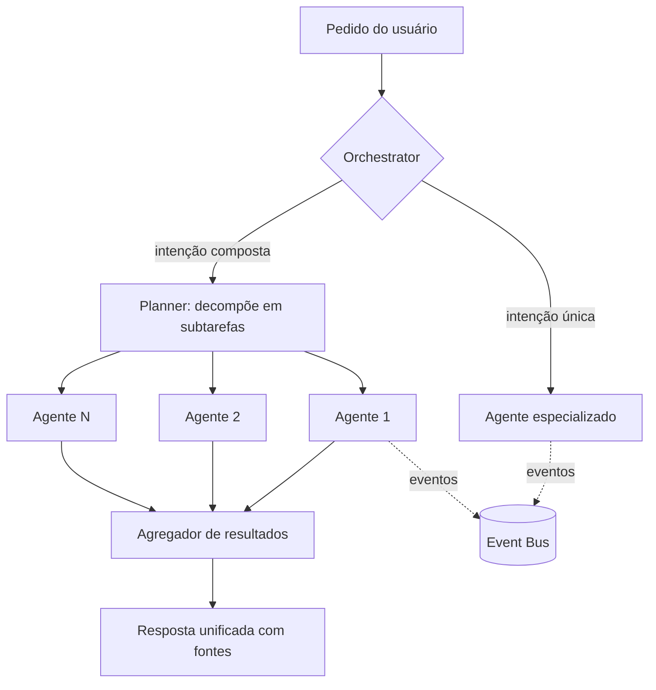

# 07 — Sistema Multi-Agentes

## Contrato comum

Todo agente implementa a mesma interface e declara um manifesto:

```yaml
# agent.manifest.yaml (exemplo)
name: health-agent
version: 1.0.0
objectives:
  - gerenciar medicamentos, consultas, exames e histórico médico
subscribes:                 # eventos que consome
  - chat.medication_instruction_parsed
  - schedule.dose_due_ack_timeout
publishes:                  # eventos que emite
  - health.dose_confirmed
  - health.dose_missed
  - health.document_filed
queue: health               # fila Celery dedicada
state: persistent           # persistente entre execuções
permissions:                # o que pede ao Permission Manager
  - read:health_records
  - write:reminders
  - notify:trusted_contact   # requer opt-in explícito
memory_scopes:              # acesso à memória compartilhada
  - read:semantic
  - write:episodic
```

Propriedades garantidas pelo Orchestrator: registro dinâmico, supervisão (restart com backoff), isolamento de falhas (um agente caído não derruba o kernel), comunicação exclusivamente via Event Bus, e checagem de permissão antes de qualquer efeito externo.

## Catálogo de agentes

| Agente | Objetivo | Consome (exemplos) | Publica (exemplos) | Fase |
|---|---|---|---|---|
| **Memory Agent** | Capturar, consolidar e recuperar memórias; executar decaimento e promoção | `chat.message_answered`, `*.completed` | `memory.item_stored`, `memory.consolidated` | MVP |
| **Task Agent** | Tarefas, projetos, checklists, priorização | `chat.task_detected`, `calendar.event_created` | `task.created`, `task.due_soon` | MVP |
| **Research Agent** | Pesquisa profunda: web + índice local + grafo, com síntese citada | `chat.research_requested` | `research.completed` | MVP |
| **Document Agent** | Classificar, extrair campos (OCR/NER), arquivar, detectar vencimentos | `indexing.document_indexed` | `document.classified`, `document.expiring` | Beta |
| **Calendar Agent** | Agenda, conflitos, tempo de deslocamento | `calendar.sync`, `task.due_soon` | `calendar.conflict_detected` | Beta |
| **Notification Agent** | Canal único de notificações: prioridade, agrupamento, escalonamento, DND | `*.notify` | `notification.delivered`, `notification.ignored` | Beta |
| **Health Agent** | Medicamentos, cronogramas de dose, consultas, exames, sintomas | `chat.medication_instruction_parsed` | `health.dose_confirmed/missed` | Beta |
| **Automation Agent** | Executar fluxos do editor visual; monitorar gatilhos | `automation.triggered` | `automation.step_completed/failed` | Beta |
| **Email Agent** | Indexar, resumir, detectar boletos/compromissos em e-mails | `email.received` | `email.actionable_detected` | Beta |
| **Habit Agent** | Hábitos, streaks, metas, Pomodoro | `routine.checkin` | `habit.streak_at_risk` | v1.0 |
| **Finance Agent** | Transações, categorização, assinaturas, projeções, alertas | `finance.transaction_imported` | `finance.anomaly_detected` | v1.0 |
| **Knowledge Agent** | Curadoria do knowledge graph: merge de entidades, novas relações | `kg.entity_candidate` | `kg.entity_merged` | v1.0 |
| **Communication Agent** | Rascunhos de mensagens/e-mails no tom do usuário | `chat.draft_requested` | `draft.ready` | v1.0 |
| **Voice Agent** | STT/TTS, wake word local, comandos por voz | `voice.audio_captured` | `voice.transcribed` | v1.0 |
| **Image Agent** | OCR, descrição, organização de fotos de documentos | `indexing.image_detected` | `image.text_extracted` | v1.0 |
| **Travel Agent** | Viagens: reservas, documentos, roteiros, alertas de voo | `email.booking_detected` | `travel.itinerary_updated` | v2.0 |
| **Shopping Agent** | Listas, garantias, rastreio de preços/pedidos | `email.order_detected` | `shopping.delivery_update` | v2.0 |
| **Device Agent** | Dispositivos conectados: presença, NFC, QR, IoT | `device.signal` | `device.context_changed` | v2.0 |
| **Plugin Agent** | Ciclo de vida de plugins: instalação, permissões, saúde | `plugin.installed` | `plugin.quarantined` | Beta (junto do SDK) |

## Orquestração



Decisões: o Planner usa IA para decompor, mas cada subtarefa vai para um agente com contrato tipado — nunca "IA chamando IA" sem esquema. Timeout e orçamento de tokens por plano. Resultado parcial é melhor que falha total: agregador tolera subtarefas falhas e as reporta.

## Memória compartilhada

Agentes não têm bancos próprios. Leem/escrevem no Memory System com escopos declarados no manifesto, o que dá auditabilidade (quem gravou o quê) e um único ponto de aplicação de privacidade.
