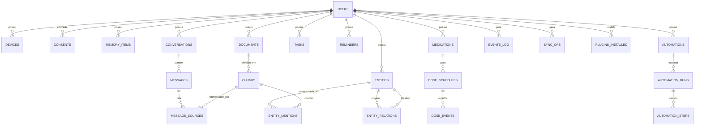

# 08 — Modelo de Dados

PostgreSQL 16 + pgvector. No desktop modo lite: SQLite + sqlite-vec com o mesmo esquema lógico (ADR-007). Migrações com Alembic. Todos os IDs são UUIDv7 (ordenáveis por tempo). Todas as tabelas de usuário carregam `user_id` (multi-tenant por linha na nuvem).

## Diagrama ER (núcleo)



## Tabelas principais (DDL resumido)

```sql
-- Identidade
CREATE TABLE users (
    id UUID PRIMARY KEY,
    email CITEXT UNIQUE NOT NULL,
    display_name TEXT,
    kdf_salt BYTEA NOT NULL,            -- derivação de chave do usuário
    created_at TIMESTAMPTZ DEFAULT now()
);

CREATE TABLE devices (
    id UUID PRIMARY KEY,
    user_id UUID REFERENCES users(id),
    platform TEXT CHECK (platform IN ('windows','linux','macos','android','ios','web')),
    public_key BYTEA NOT NULL,          -- E2E sync
    last_seen_at TIMESTAMPTZ
);

-- Consentimento granular (Permission Manager)
CREATE TABLE consents (
    id UUID PRIMARY KEY,
    user_id UUID NOT NULL REFERENCES users(id),
    scope TEXT NOT NULL,                -- ex.: 'observe:location', 'notify:trusted_contact'
    granted_to TEXT NOT NULL,           -- agente/plugin
    granted_at TIMESTAMPTZ NOT NULL,
    revoked_at TIMESTAMPTZ,
    UNIQUE (user_id, scope, granted_to)
);

-- Memória (5 camadas em uma tabela; kind discrimina)
CREATE TABLE memory_items (
    id UUID PRIMARY KEY,
    user_id UUID NOT NULL REFERENCES users(id),
    kind TEXT NOT NULL CHECK (kind IN ('temporary','episodic','semantic','procedural','permanent')),
    content TEXT NOT NULL,
    access_count INT NOT NULL DEFAULT 0,  -- reconsolidação (ADR-027)
    archived_at TIMESTAMPTZ,              -- consolidação arquiva, nunca apaga
    embedding VECTOR(384),              -- ADR-025: modelo local 384d
    importance REAL DEFAULT 0.5,        -- alimenta decaimento/promoção (ADR-027)
    source_ref JSONB,                   -- proveniência (conversa, doc, agente)
    expires_at TIMESTAMPTZ,             -- só temporary
    last_accessed_at TIMESTAMPTZ,
    created_at TIMESTAMPTZ DEFAULT now()
);
CREATE INDEX ON memory_items USING hnsw (embedding vector_cosine_ops);
CREATE INDEX ON memory_items (user_id, kind);

-- Documentos e chunks (RAG)
CREATE TABLE documents (
    id UUID PRIMARY KEY,
    user_id UUID NOT NULL REFERENCES users(id),
    source TEXT NOT NULL,               -- fs, gdrive, email, upload...
    uri TEXT NOT NULL,
    mime_type TEXT,
    content_hash BYTEA NOT NULL,        -- dedup + indexação incremental
    title TEXT,
    doc_kind TEXT,                      -- invoice, id_card, contract, note...
    expires_on DATE,                    -- vencimentos (CNH, garantia...)
    indexed_at TIMESTAMPTZ,
    UNIQUE (user_id, uri, content_hash)
);

CREATE TABLE chunks (
    id UUID PRIMARY KEY,
    document_id UUID NOT NULL REFERENCES documents(id) ON DELETE CASCADE,
    ordinal INT NOT NULL,
    text TEXT NOT NULL,
    embedding VECTOR(768),
    tsv TSVECTOR GENERATED ALWAYS AS (to_tsvector('portuguese', text)) STORED
);
CREATE INDEX ON chunks USING hnsw (embedding vector_cosine_ops);
CREATE INDEX ON chunks USING gin (tsv);   -- híbrido: vetorial + BM25

-- Knowledge graph (relacional; ADR-006)
CREATE TABLE entities (
    id UUID PRIMARY KEY,
    user_id UUID NOT NULL REFERENCES users(id),
    kind TEXT NOT NULL,                 -- person, place, project, company, file,
                                        -- medication, goal, event, account, document,
                                        -- vehicle, equipment, conversation
    name TEXT NOT NULL,
    aliases TEXT[],
    attrs JSONB DEFAULT '{}',
    confidence REAL DEFAULT 1.0
);

CREATE TABLE entity_relations (
    id UUID PRIMARY KEY,
    from_id UUID NOT NULL REFERENCES entities(id) ON DELETE CASCADE,
    to_id UUID NOT NULL REFERENCES entities(id) ON DELETE CASCADE,
    rel TEXT NOT NULL,                  -- works_at, prescribed_for, belongs_to...
    attrs JSONB DEFAULT '{}',
    valid_from DATE, valid_to DATE
);

CREATE TABLE entity_mentions (
    entity_id UUID REFERENCES entities(id) ON DELETE CASCADE,
    chunk_id UUID REFERENCES chunks(id) ON DELETE CASCADE,
    PRIMARY KEY (entity_id, chunk_id)
);

-- Chat
CREATE TABLE conversations (
    id UUID PRIMARY KEY,
    user_id UUID NOT NULL REFERENCES users(id),
    title TEXT,
    model_policy JSONB,                 -- provedor/modelo escolhido
    created_at TIMESTAMPTZ DEFAULT now()
);

CREATE TABLE messages (
    id UUID PRIMARY KEY,
    conversation_id UUID NOT NULL REFERENCES conversations(id) ON DELETE CASCADE,
    role TEXT CHECK (role IN ('user','assistant','system','tool')),
    content JSONB NOT NULL,             -- multimodal: partes texto/imagem/arquivo
    tokens_in INT, tokens_out INT,
    created_at TIMESTAMPTZ DEFAULT now()
);

CREATE TABLE message_sources (          -- citações RAG (ADR-029: generalizado)
    message_id UUID REFERENCES messages(id) ON DELETE CASCADE,
    ordinal INT,                        -- [1], [2]... citados no texto
    kind TEXT CHECK (kind IN ('document','memory')),  -- cita doc OU memória
    ref_id UUID NOT NULL,               -- chunk_id ou memory_id
    title TEXT, uri TEXT, score REAL, snippet TEXT,
    PRIMARY KEY (message_id, ordinal)
);

CREATE TABLE chat_attachments (      -- ADR-033: anexo É documento
    id UUID PRIMARY KEY,
    conversation_id UUID NOT NULL REFERENCES conversations(id) ON DELETE CASCADE,
    user_id UUID NOT NULL REFERENCES users(id),
    document_id UUID REFERENCES documents(id),   -- ingerido pelo pipeline padrão
    filename TEXT NOT NULL,
    mime_type TEXT, size_bytes INT NOT NULL,
    storage_uri TEXT NOT NULL,                   -- BlobStorePort (fs local hoje)
    state TEXT NOT NULL,                         -- pending|ready|unsupported|failed
    detail TEXT, extracted_chars INT,
    created_at TIMESTAMPTZ NOT NULL
);

-- Saúde: medicação e doses
CREATE TABLE medications (
    id UUID PRIMARY KEY,
    user_id UUID NOT NULL REFERENCES users(id),
    name TEXT NOT NULL,
    dosage TEXT,
    instructions_raw TEXT               -- texto original do usuário
);

CREATE TABLE dose_schedules (
    id UUID PRIMARY KEY,
    medication_id UUID NOT NULL REFERENCES medications(id) ON DELETE CASCADE,
    starts_at TIMESTAMPTZ NOT NULL,
    interval_minutes INT NOT NULL,      -- 480 = 8/8h
    total_doses INT NOT NULL,
    escalation_policy JSONB             -- reenvio, prioridade, contato
);

CREATE TABLE dose_events (
    id UUID PRIMARY KEY,
    schedule_id UUID NOT NULL REFERENCES dose_schedules(id) ON DELETE CASCADE,
    due_at TIMESTAMPTZ NOT NULL,
    status TEXT CHECK (status IN ('pending','confirmed','late','missed','rescheduled')),
    confirmed_at TIMESTAMPTZ
);

-- Automações
CREATE TABLE automations (
    id UUID PRIMARY KEY,
    user_id UUID NOT NULL REFERENCES users(id),
    name TEXT NOT NULL,
    graph JSONB NOT NULL,               -- DAG do editor visual (nós/arestas)
    status TEXT CHECK (status IN ('draft','active','paused','archived')),
    version INT NOT NULL DEFAULT 1
);

CREATE TABLE automation_runs (
    id UUID PRIMARY KEY,
    automation_id UUID NOT NULL REFERENCES automations(id),
    trigger_event UUID,                 -- correlação com events_log
    status TEXT CHECK (status IN ('running','completed','failed','dead_letter')),
    started_at TIMESTAMPTZ, finished_at TIMESTAMPTZ
);

CREATE TABLE automation_steps (
    run_id UUID REFERENCES automation_runs(id) ON DELETE CASCADE,
    node_id TEXT NOT NULL,
    attempt INT NOT NULL DEFAULT 1,
    status TEXT, input JSONB, output JSONB, error TEXT,
    PRIMARY KEY (run_id, node_id, attempt)
);

-- Event store (auditoria + replay + proatividade)
CREATE TABLE events_log (
    id UUID PRIMARY KEY,
    user_id UUID,
    type TEXT NOT NULL,
    schema_version INT NOT NULL,
    correlation_id UUID,
    payload JSONB NOT NULL,
    occurred_at TIMESTAMPTZ NOT NULL DEFAULT now()
) PARTITION BY RANGE (occurred_at);     -- partição mensal

-- Sync (log de operações por dispositivo)
CREATE TABLE sync_ops (
    id UUID PRIMARY KEY,
    user_id UUID NOT NULL,
    device_id UUID NOT NULL,
    lamport BIGINT NOT NULL,            -- relógio lógico
    entity_table TEXT NOT NULL,
    entity_id UUID NOT NULL,
    op TEXT CHECK (op IN ('upsert','delete')),
    payload_encrypted BYTEA NOT NULL,   -- E2E: servidor não lê
    created_at TIMESTAMPTZ DEFAULT now()
);
```

Tabelas adicionais (mesmo padrão, omitidas por brevidade): `tasks`, `reminders`, `habits`, `habit_checkins`, `finance_accounts`, `finance_transactions`, `finance_categories`, `subscriptions`, `health_records`, `vaccines`, `appointments`, `plugins_installed`, `notification_log`, `insights`.

## Decisões de modelagem

Memória unificada em `memory_items` com `kind` — as cinco memórias compartilham operações (embed, recall, decay); separar em tabelas duplicaria índice vetorial e código. Knowledge graph relacional em vez de Neo4j — travessias de profundidade ≤ 3 com CTEs recursivas cobrem os casos de uso e eliminam um banco inteiro da operação (ADR-006). Busca híbrida — `chunks` tem HNSW (vetorial) + GIN/tsvector (léxica); o RAG combina os dois com RRF. `events_log` particionado por mês — cresce sem limite; partições velhas são arquivadas em objeto frio. Criptografia — colunas sensíveis (`content`, `attrs`, payloads de saúde/finanças) criptografadas na aplicação com chave derivada do usuário; ver doc 18.
