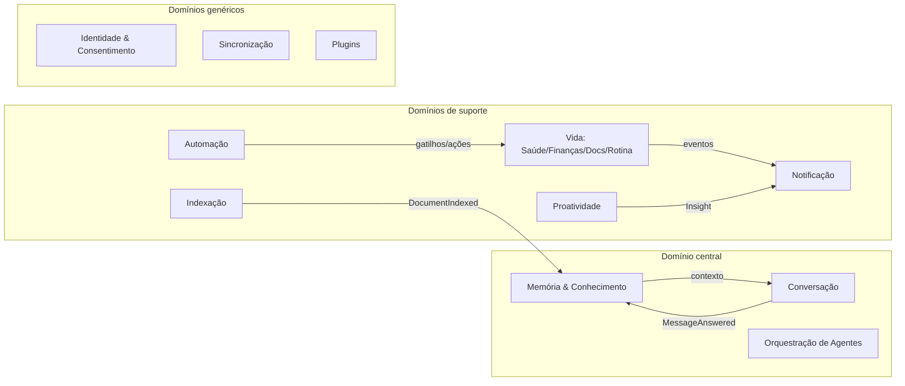

# 09 — Domínio (DDD)

## Bounded contexts

Integração entre contexts: **somente eventos publicados** (published language, doc 10). Nenhum context importa modelo de outro; onde precisa de dados, mantém projeção própria (read model).

## Agregados por contexto

### Memória & Conhecimento (core)

| Agregado | Raiz | Entidades/VOs internos | Invariantes |
|---|---|---|---|
| `Memory` | MemoryItem | Provenance (VO), Importance (VO) | temporária tem TTL; permanente só o usuário apaga; toda memória tem proveniência |
| `KnowledgeEntity` | Entity | Alias (VO), Attribute (VO) | nome+kind únicos por usuário após resolução; confidence ∈ [0,1] |
| `EntityRelation` | Relation | ValidityPeriod (VO) | from ≠ to; rel pertence a vocabulário versionado |

### Conversação (core)

| Agregado | Raiz | Internos | Invariantes |
|---|---|---|---|
| `Conversation` | Conversation | Message, ContentPart (VO), SourceCitation (VO) | mensagens são imutáveis após criadas; resposta com RAG obrigatoriamente carrega citações |

### Indexação (suporte)

| Agregado | Raiz | Internos | Invariantes |
|---|---|---|---|
| `IndexedDocument` | Document | Chunk, ContentHash (VO) | reindexar só se hash mudou; chunks ordenados e sem sobreposição indevida |

### Vida (suporte) — exemplos

| Agregado | Raiz | Internos | Invariantes |
|---|---|---|---|
| `MedicationCourse` | Medication | DoseSchedule, DoseEvent, EscalationPolicy (VO) | nº de doses = duração/intervalo; dose confirmada não volta a pending; reagendamento preserva intervalo mínimo |
| `Vault Document` | PersonalDocument | ExpiryRule (VO) | documento com validade gera lembrete automático |
| `Budget` | FinanceAccount | Transaction, Category (VO) | transação importada é imutável; recategorização preserva original |

### Automação (suporte)

| Agregado | Raiz | Internos | Invariantes |
|---|---|---|---|
| `Automation` | Automation | Node (VO), Edge (VO), Version | grafo é DAG (sem ciclos); publicar exige validação de tipos entre nós |
| `AutomationRun` | Run | StepExecution | passo N só roda se N-1 ok ou marcado continue-on-error; retries ≤ política |

### Identidade & Consentimento (genérico)

| Agregado | Raiz | Internos | Invariantes |
|---|---|---|---|
| `UserAccount` | User | Device, Credential (VO) | e-mail único; dispositivo tem chave pública |
| `Consent` | Consent | Scope (VO) | efeito externo sem consent ativo = violação (bloqueio no kernel); revogação é imediata e auditada |

## Value Objects transversais

`UserId`, `Embedding(dim=768)`, `Provenance(source, ref, timestamp)`, `Importance(0..1)`, `Scope("verbo:recurso")`, `Money(amount, currency)`, `TimeWindow`, `CronSpec`.

## Domain services

- `ConsolidationService` — política de promoção/decaimento de memórias (puro, testável).
- `EntityResolutionService` — deduplicação de entidades por similaridade + regras.
- `DoseCalculatorService` — "7 dias de 8/8h" → cronograma; puro, sem IA (a IA só extrai os parâmetros).
- `RetrievalService` — fusão vetorial+léxica+grafo com RRF.
- `EscalationService` — máquina de escalonamento de notificações.

## Linguagem ubíqua (extrato)

**Memória** (não "registro"), **consolidação** (promoção entre camadas), **proveniência** (origem rastreável de toda memória/resposta), **citação** (fonte exibida ao usuário), **consentimento** (permissão granular revogável), **insight** (sugestão proativa explicável), **curso de medicação** (medicamento + cronograma + histórico), **fluxo** (automação publicada), **execução** (run de um fluxo).
