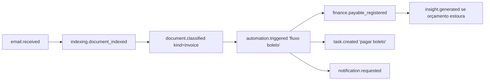

# 10 — Catálogo de Eventos

## Envelope padrão

Todo evento segue o mesmo envelope (Pydantic, validado no publish e no consume):

```json
{
  "event_id": "uuid7",
  "type": "health.dose_missed",
  "schema_version": 1,
  "occurred_at": "2026-07-16T14:00:00Z",
  "user_id": "uuid",
  "correlation_id": "uuid",
  "causation_id": "uuid",
  "producer": "health-agent@1.0.0",
  "payload": { }
}
```

Regras: nomes `contexto.evento_no_passado`; payloads versionados (`schema_version`), mudanças breaking exigem nova versão com consumo paralelo; entrega at-least-once → consumidores idempotentes (dedup por `event_id`); DLQ por consumidor após N tentativas; tudo gravado em `events_log` (replay em dev, auditoria em prod).

## Catálogo (por contexto)

### chat.*
| Evento | Payload (essência) | Produtores → consumidores típicos |
|---|---|---|
| `chat.message_received` | conversation_id, content_parts | API → Orchestrator |
| `chat.message_answered` | message_id, sources[], tokens | Orchestrator → Memory Agent, Métricas |
| `chat.task_detected` | text, due_hint | Orchestrator → Task Agent |
| `chat.medication_instruction_parsed` | drug, duration, interval | Orchestrator → Health Agent |
| `chat.research_requested` | query, depth | Orchestrator → Research Agent |

### memory.*
| Evento | Payload | Fluxo |
|---|---|---|
| `memory.item_stored` | memory_id, kind, provenance | Memory System → interesse geral |
| `memory.consolidated` | promoted[], decayed[], forgotten[] | job noturno → Métricas |
| `memory.forgotten` | memory_id, reason(user\|decay) | → Sync, auditoria |

### indexing.*
| Evento | Payload | Fluxo |
|---|---|---|
| `indexing.file_detected` | uri, hash, mime | File Watcher → Worker |
| `indexing.document_indexed` | document_id, chunks, entities_found | Worker → Document Agent, KG |
| `indexing.failed` | uri, error, attempt | Worker → DLQ, Notification |

### kg.*

| Evento | Payload | Fluxo |
|---|---|---|
| `kg.entity_candidate` | kind, name, evidence | Worker → Knowledge Agent |
| `kg.entity_merged` | winner_id, merged_ids | Knowledge Agent → projeções |
| `kg.relation_added` | from, to, rel | → RAG (expansão de contexto) |

### task.* / calendar.*

| Evento | Payload | Fluxo |
|---|---|---|
| `task.created` · `task.completed` · `task.due_soon` | task_id, due_at | Task Agent ↔ Notification, Proactivity |
| `calendar.event_created` · `calendar.conflict_detected` | event_id, overlap | Calendar Agent → Notification |

### health.*

| Evento | Payload | Fluxo |
|---|---|---|
| `health.course_created` | medication_id, schedule | Health Agent → Scheduler |
| `health.dose_due` | dose_id, due_at, priority | Scheduler → Notification Agent |
| `health.dose_confirmed` / `health.dose_missed` | dose_id, delay | Notification → Health Agent (histórico) |
| `health.document_filed` | record_id, kind | Document Agent → Health Agent |

### document.*

| Evento | Payload | Fluxo |
|---|---|---|
| `document.classified` | document_id, doc_kind, fields{} | Document Agent → Vault, Finance |
| `document.expiring` | document_id, expires_on, days_left | job diário → Notification, Proactivity |

### finance.*

| Evento | Payload | Fluxo |
|---|---|---|
| `finance.transaction_imported` | tx_id, amount, merchant | conector → Finance Agent |
| `finance.categorized` | tx_id, category, confidence | Finance Agent → projeções |
| `finance.anomaly_detected` | kind(spike\|new_subscription\|duplicate), evidence | Finance Agent → Notification |

### automation.*

| Evento | Payload | Fluxo |
|---|---|---|
| `automation.triggered` | automation_id, trigger_event | Engine → Run |
| `automation.step_completed` / `automation.step_failed` | run_id, node_id, attempt | Engine → logs, retry |
| `automation.run_completed` / `automation.run_dead_lettered` | run_id, status | Engine → Notification |

### notification.*

| Evento | Payload | Fluxo |
|---|---|---|
| `notification.requested` | channel, priority, actions[], escalation? | qualquer agente → Notification Agent |
| `notification.delivered` / `notification.ignored` / `notification.actioned` | notification_id, action | Notification Agent → produtor original |
| `notification.escalated` | notification_id, level, target | Notification Agent → auditoria |

### insight.* (proatividade)

| Evento | Payload | Fluxo |
|---|---|---|
| `insight.generated` | kind, message, explanation, evidence[], confidence | Proactivity → Notification |
| `insight.dismissed` / `insight.accepted` | insight_id | UI → Proactivity (aprendizado procedural) |

### plugin.* / sync.* / auth.*

| Evento | Payload | Fluxo |
|---|---|---|
| `plugin.installed` · `plugin.permission_requested` · `plugin.quarantined` | plugin_id, scopes | Plugin Host ↔ Permission Manager |
| `sync.ops_pushed` · `sync.conflict_resolved` | device_id, count, strategy | Sync Engine → auditoria |
| `auth.login_succeeded` · `auth.suspicious_activity` | device, geo | API → Notification, auditoria |

## Fluxo exemplo — boleto recebido por e-mail


