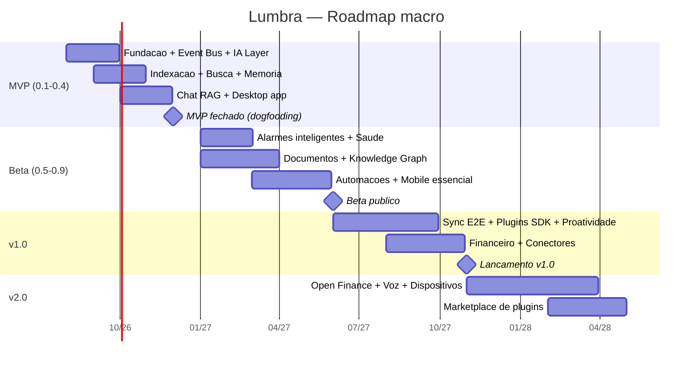

# 13 — Roadmap

Princípio: cada versão entrega valor completo e utilizável. O risco nº 1 é escopo (R-01); feature fora da versão corrente exige ADR aprovado.

## Estado de execução — levas de consolidação

Dentro do MVP, o backend evoluiu por épicos (E0–E2) e, depois, por **levas
de consolidação** — trilhas de engenharia entre construir features e o
dogfooding. Registro honesto do que está entregue:

| Leva | Foco | Estado |
|---|---|---|
| E0–E2 | Fundação, Event Bus, IA, indexação/RAG, memória, chat com citações | ✅ |
| Consolidação 1 | Auditoria (código morto, duplicação, segurança, performance, cobertura) | ✅ |
| **Leva 3** | Developer Experience e instalação limpa: CLI `lumbra` (doctor/dev/up/init), System Health, First Run Wizard | ✅ (ADR-037) |
| **Leva 2** | Endurecimento para produção do Event Bus | ✅ (ADRs 038–041) |

**Leva 2 em detalhe** (Event Bus de produção): concorrência por despacho
particionado — ordem por `partition_key`, paralelismo entre chaves,
determinístico e genérico (ADR-038); resiliência — backoff exponencial,
DLQ limitada, recuperação após crash comprovada por teste (ADR-039);
observabilidade — `health()` + endpoint `/api/v1/system/eventbus` com
lag/backlog/DLQ (ADR-040); carga e baseline com prova de escala — 1→8
workers acelera ~7× em trabalho de I/O (ADR-041).

**Fase corrente — dogfooding intensivo + corpus de avaliação.** O foco sai
de construir infraestrutura e passa a validar a experiência de uso real.
Problemas viram um backlog estruturado (`docs/22`); documentos reais de
várias categorias formam um Corpus de Avaliação (`docs/23`) com perguntas
de referência e respostas esperadas, alimentando continuamente o golden
set. A revisão do chunking (#10) só é retomada quando o corpus for
representativo — decisão guiada por muitos casos, não por um único.

## MVP — "o segundo cérebro mínimo" (desktop)

**Promessa:** "Aponte para suas pastas e converse com tudo que você tem."

Entra: monorepo + CI, Event Bus, camada de IA multi-provedor (OpenAI/Anthropic/Ollama), indexação de pastas locais (PDF/Office/texto/código), busca híbrida < 300 ms, memória em 5 camadas (consolidação básica), chat com streaming + citações + drag-and-drop, Memory/Task/Research Agents, app desktop com backend embutido, controle total das memórias, golden set de RAG no CI.

Fora (com data para entrar): mobile, sync, automações, plugins, saúde, finanças, proatividade.

**Critério de saída:** 4 semanas de dogfooding diário pela equipe; precisão do golden set ≥ alvo; zero perda de dados.

## Beta — "cuida da sua vida, não só dos seus arquivos"

Entra: alarmes inteligentes de medicação (parse NL → cronograma → confirmação → escalonamento), módulo saúde, cofre de documentos com OCR/classificação/vencimentos, knowledge graph + `/kg/ask`, motor + editor visual de automações, mobile essencial (chat, tarefas, alarmes nativos, push), Notification/Health/Document/Calendar/Email/Automation/Plugin Agents.

**Critério de saída:** beta público com ≥ 1.000 usuários ativos; D30 ≥ 40%; zero incidentes de segurança; pentest concluído.

## v1.0 — "plataforma"

Entra: sync multi-dispositivo E2E, SDK de plugins + diretório oficial, motor de proatividade (insights explicáveis com feedback), financeiro (importação, categorização, assinaturas, alertas), conectores Gmail/Drive, web app completo, dashboard com widgets.

**Critério de saída:** NPS ≥ 50; 10 plugins de terceiros no diretório; SLO 99,9% nos serviços cloud.

## v2.0 — "ecossistema"

Entra: Open Finance real (agregador licenciado), voz completa (wake word local, TTS), Travel/Shopping/Device Agents, NFC/QR/IoT, marketplace de plugins com monetização, times/família (multiusuário), API pública para desenvolvedores.

## Cadência

Release train quinzenal interno; canal stable mensal. Feature flags para tudo que cruza versões. Cada