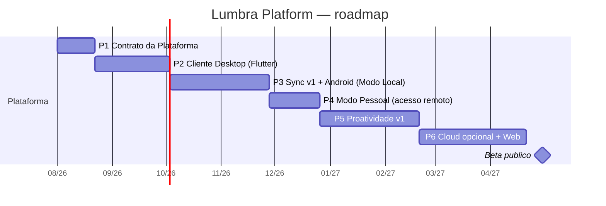

# 13 — Roadmap

> Reescrito em 2026-07-24 sob a visão oficial da Lumbra Platform (docs/24).
> Princípios que governam este roadmap: **Product First** (cada épico entrega
> algo utilizável — infraestrutura só a serviço de evolução perceptível) e
> **Dogfooding** (a Lumbra é o software principal do autor). O risco nº 1
> segue sendo escopo (R-01): feature fora do épico corrente exige ADR.

## O que já foi construído (fundação, concluída)

| Fase | Entrega | Estado |
|---|---|---|
| E0–E2 | Core, Event Bus, AI Gateway, indexação/RAG híbrido, memória em 5 camadas, chat com citações e streaming, KG inicial, Developer Console | ✅ |
| Consolidação 1 | Auditoria: código morto, duplicação, segurança, performance, cobertura | ✅ |
| Leva 3 | DX e instalação limpa: CLI `lumbra`, System Health, First Run Wizard (ADR-037) | ✅ |
| Leva 2 | Event Bus de produção: concorrência particionada, resiliência, observabilidade, carga (ADRs 038–041) | ✅ |
| CI | 7 jobs verdes: quality, tests, windows, integration (portão de cobertura + golden set de RAG), dart-client (cliente gerado do contrato), flutter-app, docker | ✅ |
| Dogfooding | Backlog estruturado (docs/22) + Corpus de Avaliação (docs/23), fatura como benchmark permanente | 🔄 contínuo |

Essa fundação foi declarada **suficientemente madura** em 2026-07-24. A
partir daqui, a Lumbra evolui como **plataforma** (docs/24, ADRs 042–046).

## Épicos da plataforma

Datas são ordem de grandeza, não compromisso — a régua de conclusão de cada
épico é o **entregável utilizável**, verificado em dogfooding, nunca o
calendário.

### P1 — Contrato da Plataforma (~3 semanas)

O alicerce de tudo que vem depois: o contrato entre Core e clientes vira
artefato oficial.

Entra: exportação OpenAPI completa da Platform API v1 (validada no CI —
o contrato quebra o build se mudar sem intenção); modelo de dispositivos
no Core (registro, chaves Ed25519, pareamento — base do ADR-045);
reorganização do monorepo (`core/`, `clients/`, `packages/` — docs/24)
com CI ajustado; geração do cliente Dart a partir do OpenAPI.

**Entregável utilizável:** a mesma Lumbra de hoje, com contrato publicado e
versionado. `lumbra doctor` passa a mostrar identidade do Nó e dispositivos
pareados.

### P2 — Cliente Desktop (~6 semanas)

O primeiro rosto real da plataforma. Flutter, Windows primeiro (Linux/macOS
compilam do mesmo código, validados depois).

Entra: app desktop com chat (streaming + citações + anexos), documentos
(indexação de pastas, status do pipeline), memórias (ver/editar/apagar —
controle total), saúde do sistema (a página System Health vira nativa);
Core como sidecar gerenciado — o app sobe o Nó sozinho, usuário não vê
Python (ADR-046); instalador Windows.

**Entregável utilizável:** o Developer Console deixa de ser a interface do
dia a dia. **Critério da meta do produto: a Lumbra vira o primeiro programa
aberto ao ligar o computador.**

> **✅ ENTREGUE.** A Lumbra instala com dois cliques (284 MB, Inno Setup),
> aparece no menu Iniciar e abre sem Python, sem Docker e sem terminal — o
> Nó virou executável com PostgreSQL embutido (ADR-069) e o app o sobe e o
> encerra sozinho (ADR-071/073). Fica para depois, dentro do escopo do P2:
> a página System Health nativa.
>
> O caminho custou mais do que o previsto, e vale dizer por quê: nenhuma das
> sete falhas encontradas estava na parte "difícil" (congelar Python,
> embutir Postgres). Todas estavam em **estados intermediários que viravam
> permanentes** — banco interrompido que não subia mais, cache de modelo
> pela metade, processos fantasmas segurando o desligamento, `.env` lido por
> acaso. Ver docs/27.

### P3 — Sync Engine v1 + Android, Modo Local (~8 semanas)

O épico mais difícil — por isso o escopo do sync é deliberadamente pequeno
(ADR-044).

Entra: log de eventos com HLC no Core; replicação incremental na LAN
(descoberta mDNS, TLS entre dispositivos); pareamento por QR (ADR-045);
tipos append-only primeiro (capturas, conversas, memórias), LWW por campo
na sequência; app Android (mesmo código Flutter): captura rápida
(texto/foto/áudio), chat contra o Nó, leitura offline da réplica; blobs
seletivos (recentes/fixados).

**Entregável utilizável:** anotar uma ideia no celular na rua e ela estar
no desktop ao chegar em casa; **pegar o telefone e continuar de onde parou
— pela primeira vez, existe UMA Lumbra em dois dispositivos.**

### P4 — Modo Pessoal (~4 semanas)

O Nó alcançável de qualquer lugar — sem nuvem de terceiros.

Entra: Nó acessível por overlay WireGuard (Tailscale primeiro, infra
própria avaliada depois); sync e chat remotos idênticos aos locais;
notificações push no Android; sync em segundo plano.

**Entregável utilizável:** a Lumbra funciona inteira fora de casa, com o
home server/PC como servidor pessoal.

### P5 — Proatividade v1 (~8 semanas)

O antigo "Beta" reencaixado — agora sobre plataforma pronta, com celular
para notificar e sync para manter tudo coerente.

Entra: agenda e alarmes em linguagem natural (parse → cronograma →
confirmação → escalonamento), com alarme nativo no Android; vencimentos de
documentos (o cofre detecta datas e antecipa); resumo diário ("bom dia:
3 compromissos, 1 vencimento, 2 projetos parados"); sugestões explicáveis
(Explain Engine) com feedback e controle total.

**Entregável utilizável:** a Lumbra deixa de só responder e passa a
**antecipar** — princípio 10 saindo do papel.

### P6 — Modo Cloud opcional + Web (~2 meses)

Entra: relay E2E (servidor só vê ciphertext — ADR-045); cliente Web
(mesmo código Flutter) para acesso remoto e administração; empacotamento
Linux/macOS promovido a canal oficial; Play Store se houver beta público.

**Entregável utilizável:** qualquer navegador vira porta de entrada — sem
jamais tornar a nuvem obrigatória.

## Trilhas contínuas (não são épicos, não param)

* **Dogfooding + corpus:** issues em docs/22, corpus de avaliação em
  docs/23 crescendo em variedade. Chunking ciente de estrutura (#10) e
  guardrail por evidência (#11) **entregues** (ADR-051/052): a fatura é
  recuperada corretamente e provada no golden set. Evoluções registradas:
  levar o `section_path` também à prosa do contexto (hoje só as tabelas
  rotulam explícito), e reindexação em lote dos documentos já indexados
  para preencherem blocos/metadados novos (chunks legados coexistem nulos).
* **Camada de agentes (fase A):** **entregue A0→A9** (docs/26, ADRs 055–062).
  A Lumbra virou plataforma nativa para agentes por EVOLUÇÃO — Capability Model
  e registries, Orchestrator em camadas (IA por último), Execution Tree,
  Decision Engine, Sandbox com escopo/budget, delegação com anti-escalada, e
  rotas `/api/v1/agents` no contrato. Nada de Core novo: agentes são
  consumidores da plataforma. Pendente: A10 (mobile), que depende do épico de
  Sync (P3) e do app Android compilado.
* **Qualidade:** golden set de RAG (agora com `answer_cases` de nível-chunk
  travando o #10), portão de cobertura da suíte inteira, baseline de
  performance como instrumento (ADR-041).
* **iOS:** o código Flutter já o cobre; o alvo espera conta Apple
  Developer + máquina macOS fazerem sentido (dispositivo do autor é
  Android — decisão registrada, não esquecida).

## Critérios de saída por horizonte

* **Plataforma mínima (P1–P3):** dogfooding diário em 2 dispositivos; zero
  perda de dados; sync sobrevive a queda de rede no meio da transferência.
* **Plataforma completa (P4–P6):** 4 semanas de uso remoto sem recorrer a
  nenhum serviço de terceiros além do overlay; conflitos de sync sempre
  visíveis, nunca silenciosos.
* **Beta público (pós-P6):** instalação limpa por terceiros sem o autor
  por perto (o teste da Leva 3, agora com clientes); pentest do modo
  Pessoal e do relay.
