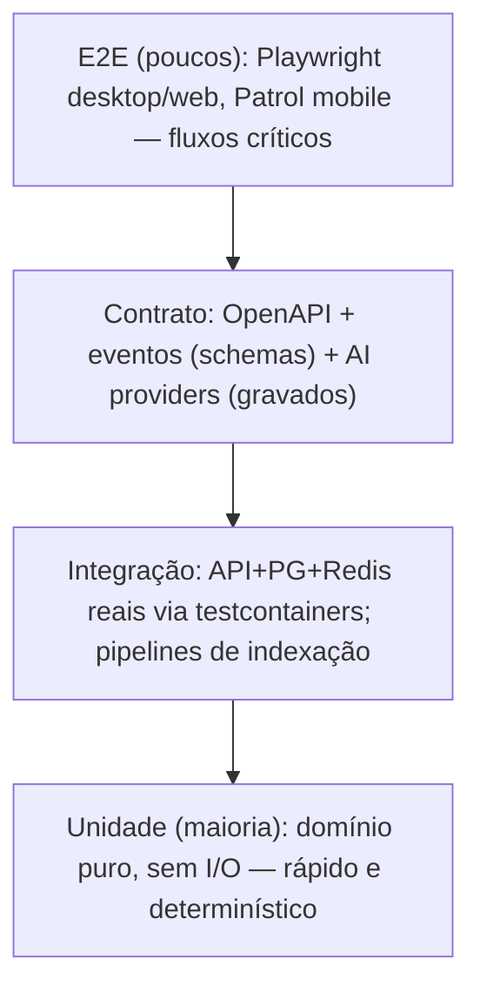

# 14 — Estratégia de Testes

## Pirâmide

## Por camada

**Domínio (unidade).** Entidades, agregados, domain services (DoseCalculator, Consolidation, EntityResolution, Escalation) — puros, sem mock de infra. Property-based testing (Hypothesis) nos invariantes: "nº de doses × intervalo cobre a duração", "DAG publicado nunca tem ciclo", "sync converge para o mesmo estado independente da ordem".

**Aplicação.** Use cases com fakes in-memory dos ports (não mocks de framework). Cada command handler: caso feliz, violação de invariante, violação de permissão.

**Infraestrutura (integração).** Testcontainers: PostgreSQL+pgvector, Redis. Migrações Alembic aplicadas do zero a cada suíte. Indexação: corpus fixo de arquivos (PDF com tabela, DOCX, escaneado p/ OCR, zip, código) com saídas esperadas.

**Contratos.** OpenAPI gerado pelo FastAPI validado contra snapshot (breaking change quebra CI). Eventos: schemas Pydantic versionados com testes de compatibilidade (consumidor v1 lê payload v2). AI providers: respostas gravadas (VCR) para determinismo + suite semanal "live" opcional.

**E2E.** Somente jornadas críticas: onboarding → indexar pasta → perguntar → resposta com citação; criar medicação → receber alarme → confirmar; criar automação → disparar → verificar efeitos.

## Avaliação de IA (diferencial do projeto)

- **Golden set de RAG** ✅ (v1 desde E1-3c): corpus fixo em `tests/rag/corpus/` + consultas com resposta esperada em `tests/rag/golden.json` (tipos: lexical, semantic, exact). O avaliador (`tests/integration/test_rag_golden.py`) indexa pelo MESMO caminho do produto (document.index → pipeline com embeddings → document.find híbrido) e mede **recall@1, recall@3 e MRR**; abaixo dos thresholds do golden.json, o CI quebra. Baseline v1: recall@1 0.88, recall@3 0.96, MRR 0.93 (n=24) com thresholds 0.75/0.90/0.80. Evolução: crescer para ≥ 200 pares, groundedness (resposta suportada pelas fontes) e taxa de "não sei" correta quando o chat (E2) existir; ao ampliar o corpus, recalibrar thresholds com folga de ~10%.
- **Parse de instruções** (medicação, tarefas): dataset rotulado de frases reais em PT-BR; exatidão de extração ≥ 95% para o Beta.
- **Insights**: precisão avaliada por feedback do usuário (accepted/dismissed) monitorada em produção.

## Regras

Cobertura: domínio ≥ 80% (gate), aplicação ≥ 70%; sem gate de cobertura em UI. Testes flaky são quarentenados em 24 h e consertados ou apagados. Nenhum mock permanente: fakes in-memory vivem em `core/testing/` e são mantidos como código de produção. Todo bug corrigido ganha teste de regressão antes do fix.
