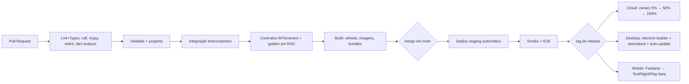

# 15 — CI/CD

## Pipeline (GitHub Actions, monorepo com path filters)

## Regras

- Trunk-based: branches curtas, merge em `main` sempre deployável; feature flags em vez de branches longas.
- PR exige: CI verde, 1 review, cobertura de domínio não regride, golden set de RAG não regride.
- Commits convencionais (`feat:`, `fix:`, `docs:`...) → changelog e versionamento semântico automáticos.
- Segurança no pipeline: SAST (Semgrep), scan de dependências (osv-scanner/Dependabot), scan de segredos (gitleaks), imagens assinadas (cosign) + SBOM.
- Migrações de banco: sempre backward-compatible (expand→migrate→contract); testadas contra snapshot de staging.

## Ambientes

| Ambiente | Propósito | Deploy | Dados |
|---|---|---|---|
| dev local | docker-compose completo | manual | sintéticos |
| staging | espelho da prod | auto (main) | sintéticos + anonimizados |
| prod cloud | usuários | canary progressivo com rollback automático (métricas de erro/latência) | reais |
| desktop stable/beta | canais de auto-update | por tag | locais do usuário |

Desktop: canal beta recebe toda release; stable mensal. Rollback = re-apontar canal para versão anterior; migrações locais de dados têm downgrade testado. Mobile: release train quinzenal nas lojas.
