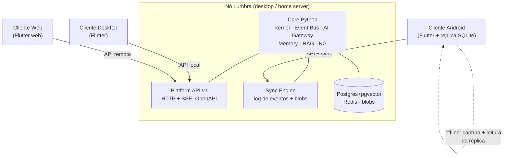

# 24 — Lumbra Platform: visão oficial e arquitetura

> Documento constitucional. Redefine o que a Lumbra É a partir de 2026-07-24.
> Decisões técnicas justificadas nos ADRs 042–046 (`docs/20-adrs.md`).
> Roadmap derivado desta visão em `docs/13-roadmap.md`.

## A visão

A Lumbra **não** é um aplicativo desktop, nem mobile, nem um chatbot.
A Lumbra é uma **Plataforma Pessoal com IA**. Desktop, Android, iPhone e Web
são apenas formas diferentes de acessar a mesma plataforma.

**Existe apenas UMA Lumbra.** Uma memória, um Knowledge Graph, uma agenda,
um conjunto de documentos, um histórico de conversas, um sistema de
automações. O usuário nunca sente que mudou de aplicação — apenas mudou
de dispositivo.

**Meta do produto:** ser o primeiro programa aberto ao ligar o computador e
o último fechado antes de desligá-lo; ao pegar o telefone, continuar
exatamente de onde parou.

## Os dez princípios

1. **Single Core.** Existe um único Core. Toda regra de negócio vive nele.
   Jamais duplicar lógica entre plataformas.
2. **API First.** Tudo nasce no Core → é exposto por API → ganha interface.
   Nunca o contrário.
3. **Local First.** Toda funcionalidade opera completamente offline dentro
   das capacidades do dispositivo. Nuvem é opcional, jamais obrigatória.
4. **Multi Device First.** Toda funcionalidade nova é pensada para Windows,
   Linux, macOS, Android, iPhone e Web — mesmo produto, interfaces
   adequadas a cada dispositivo.
5. **Uma única identidade.** Um usuário, N dispositivos, um estado — tudo
   sincronizado.
6. **Sync Engine.** Sincronização é componente central da arquitetura, não
   detalhe. Três modos: Local (LAN, sem internet), Pessoal (seu PC como
   servidor) e Cloud (opcional, sempre cifrado, sempre seu).
7. **Device Capabilities.** Cada dispositivo contribui com o que tem:
   desktop traz IA local, OCR e indexação pesada; o celular traz câmera,
   captura rápida, localização, notificações e alarmes; a web traz acesso
   remoto e administração. Todos usam o mesmo Core.
8. **Product First.** Cada épico entrega algo utilizável. Infraestrutura
   só nasce a serviço de evolução perceptível do produto.
9. **Dogfooding.** A Lumbra é o software principal do próprio autor. Toda
   decisão facilita o uso diário real.
10. **Assistente Proativo.** No longo prazo, a Lumbra antecipa: lembra
    compromissos, detecta projetos esquecidos, sugere documentos, antecipa
    vencimentos — sempre sob controle total do usuário.

## Topologia: um Nó, muitos clientes (ADR-042)

O conceito central da arquitetura é o **Nó Lumbra**: o Core Python completo
(kernel, Event Bus, AI Gateway, Memory Engine, RAG, Knowledge Graph,
Postgres+pgvector, Redis) rodando onde há capacidade computacional — o
desktop do usuário ou uma máquina dedicada (mini-PC, home server). O Nó é
a fonte de verdade e o único lugar onde regra de negócio executa.

Os **clientes** (app desktop, app Android/iOS, web) são finos: falam a
Platform API (HTTP + SSE) e mantêm uma **réplica local** (SQLite) das
projeções que lhes interessam, para leitura e captura offline.



O que "Local First" significa em cada dispositivo (princípios 3 e 7 juntos):

| Dispositivo | Offline garante | Exige o Nó |
|---|---|---|
| Desktop (= Nó) | tudo: chat, indexação, IA local, busca | — |
| Android/iPhone | captura (texto/foto/áudio), leitura de conversas/memórias/documentos replicados, busca na réplica, alarmes | IA, indexação, OCR pesado |
| Web | nada (é acesso remoto por definição) | tudo |

O celular **não** roda o Core: Python + pgvector + Ollama não executam de
forma sã em Android/iOS, e um "core mobile" paralelo violaria o Single
Core no primeiro mês. A réplica local dá o offline; o Nó dá a inteligência.

## Stack de interface: Flutter (ADR-043)

Um único código Dart/Flutter compila para as seis plataformas-alvo. A
comparação completa está no ADR-043; o resumo da decisão:

| Critério | Flutter | Tauri 2 | Electron | React Native | Qt/PySide6 | .NET MAUI |
|---|---|---|---|---|---|---|
| Win/Linux/macOS | ✅ estável | ✅ excelente | ✅ pesado | ⚠️ parcial | ✅ | ❌ sem Linux |
| Android/iOS | ✅ maduro | ⚠️ jovem (2.x) | ❌ | ✅ maduro | ⚠️ doloroso | ✅ |
| Web | ✅ (canvas) | n/a (é web) | n/a | ⚠️ fraco | ❌ | ⚠️ Blazor à parte |
| 1 código p/ tudo | ✅ | ⚠️ quase | ❌ | ⚠️ | ⚠️ | ❌ |
| Integração c/ Core | HTTP/SSE | HTTP/SSE | HTTP/SSE | HTTP/SSE | in-process | HTTP/SSE |

O argumento decisivo: como a Lumbra é **API First**, a interface não
precisa de integração binária com Python — ela fala HTTP/SSE com o Nó.
Isso elimina a única vantagem real do Qt/PySide6 (mesmo processo Python)
e liberta a escolha para o critério que importa: **um código, seis alvos,
dez anos**. Flutter é hoje a única stack que entrega isso com desktop e
mobile simultaneamente maduros.

O cliente Dart da API é **gerado do OpenAPI** exportado pelo Core — o
contrato é a fonte; o cliente nunca é escrito à mão (princípio 2).

## Sync Engine (ADR-044)

### A ideia: sincronizar o que já existe

A Lumbra já é orientada a eventos: todo fato relevante vira um
`DomainEvent` com envelope, `partition_key` e event store. O Sync Engine
**replica o log de eventos entre dispositivos** — não inventa um segundo
modelo de dados:

* Cada dispositivo mantém um **log append-only** dos eventos que originou,
  carimbados com **HLC** (Hybrid Logical Clock: ordem causal sem depender
  de relógio de parede confiável).
* Sincronizar = trocar os sufixos de log que o outro lado ainda não viu
  (**incremental** por natureza), na ordem da `partition_key` — a mesma
  chave que já garante ordem no Event Bus garante ordem no sync.
* Cada lado **reaplica** os eventos recebidos nas suas projeções, pelo
  mesmo mecanismo de consumo idempotente (dedup por `event_id`) que o bus
  já tem.
* **Blobs** (documentos, fotos) são endereçados por hash de conteúdo — a
  ingestão já calcula hash — e transferidos separadamente, com
  **sync seletivo**: o celular assina só as projeções e blobs que quer
  (recentes, fixados), nunca os 50 GB do acervo.

### Conflitos

Plataforma **pessoal**: um usuário, N dispositivos. Escrita concorrente no
mesmo campo é rara, então a resolução é por camadas — a maioria dos tipos
é livre de conflito por natureza (conversas, memórias e eventos de captura
são append-only; tags são união de conjuntos). Para campos escalares
(título, status), **LWW por campo** usando HLC. Quando nada disso decide
com segurança, o conflito **não é resolvido em silêncio**: vira item
visível na UI para o usuário escolher — controle total, princípio 10.

### Os três modos

| Modo | Transporte | Quando |
|---|---|---|
| **Local** | descoberta na LAN (mDNS) + TLS direto entre dispositivos | em casa, sem internet |
| **Pessoal** | overlay WireGuard (Tailscale primeiro, infra própria depois) até o Nó | fora de casa, seu PC/home server ligado |
| **Cloud** | relay cifrado: o servidor só vê ciphertext (E2E com a chave-mestra) | opcional, quando nenhum nó está alcançável |

Versionamento: o protocolo de sync tem versão própria negociada no
handshake; nó e cliente incompatíveis falham cedo, com mensagem no estilo
`doctor` (o que fazer, não só o que quebrou).

## Identidade, criptografia e sessões (ADR-045)

* **Identidade = par de chaves, não conta em servidor.** Cada dispositivo
  gera um par Ed25519 na instalação. **Pareamento por QR code**: o novo
  dispositivo exibe sua chave pública; o Nó (já confiável) lê, autoriza e
  assina — sem e-mail, sem senha em servidor de terceiros, sem internet.
* **Sessões:** JWT de curta duração assinado pelo Nó por dispositivo
  (infra `pyjwt` existente), renovado automaticamente; revogar um
  dispositivo = revogar sua chave no Nó.
* **Chave-mestra:** derivada de passphrase via Argon2id (infra
  `argon2-cffi` existente). Usada para o E2E do modo Cloud e para
  cifragem-em-repouso da réplica mobile (SQLCipher). Código de recuperação
  gerado uma única vez no primeiro uso.
* **Transporte:** TLS sempre, inclusive na LAN (certificados de
  dispositivo emitidos pelo Nó).

## Distribuição e atualizações (ADR-046)

* **Desktop:** instalador (Windows primeiro) que embute o app Flutter e o
  Core como *sidecar* gerenciado — o app sobe/derruba o Nó; o usuário não
  vê Python. Auto-update por canal (stable/dev) com verificação de
  assinatura.
* **Android:** APK direto (sideload) durante o desenvolvimento — sem
  esperar loja; Play Store quando houver beta público.
* **Compatibilidade:** Platform API versionada (`/api/v1`) com janela N−1:
  clientes de uma versão atrás continuam funcionando enquanto atualizam.
  O Nó recusa clientes fora da janela com instrução de correção.

## Estrutura de diretórios da plataforma

Monorepo — um produto, um repositório, um CI:

```
lumbra/
├── core/                    # o motor Python — única fonte de regra de negócio
│   ├── src/lumbra/          #   (o atual src/lumbra, movido)
│   ├── tests/
│   ├── pyproject.toml
│   └── alembic.ini
├── clients/
│   └── app/                 # Flutter: UM código → windows/linux/macos/android/ios/web
│       ├── lib/
│       └── ...
├── packages/
│   └── lumbra_api_dart/     # cliente Dart GERADO do OpenAPI (nunca escrito à mão)
├── docs/                    # inalterado
├── docker/
└── .github/workflows/       # CI: caminhos ajustados; jobs Flutter somam-se aos atuais
```

A movimentação física de `src/` → `core/` acontece no épico P1 (junto do
ajuste de CI), não antes — reorganização sem entregável associado é
exatamente o tipo de trabalho que o princípio 8 proíbe.

## Riscos assumidos (registro honesto)

* **Dart é uma linguagem nova para o time.** Custo real de aprendizado;
  mitigado por ser UMA linguagem para as seis plataformas, e pela lógica
  viver toda no Core (a UI é fina por princípio).
* **Sync é o problema difícil.** Por isso o v1 é deliberadamente pequeno:
  modo Local, tipos append-only primeiro, LWW por campo depois, UI de
  conflito antes de qualquer esperteza automática.
* **Flutter Web renderiza em canvas** — adequado a um app atrás de login,
  inadequado a site público de conteúdo. Se um dia houver site, é
  marketing, não o produto.
* **Dependência do Google no Flutter.** Mitigada pelo tamanho da
  comunidade e por a UI ser substituível: o valor da Lumbra vive no Core
  e no contrato OpenAPI, que não dependem de stack de interface.
