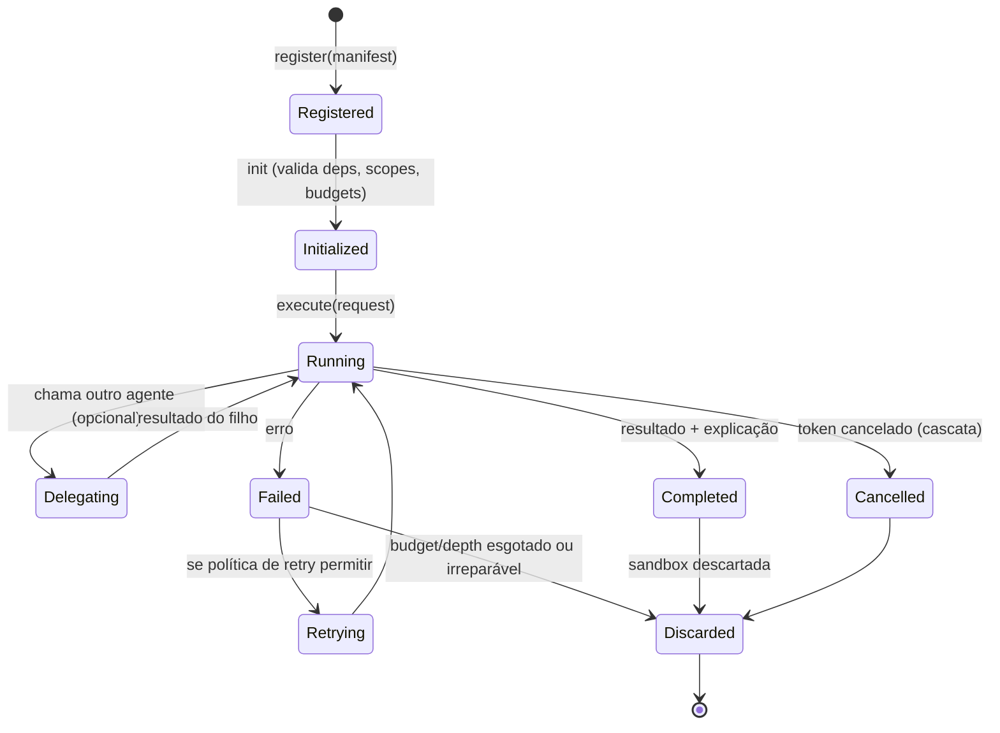
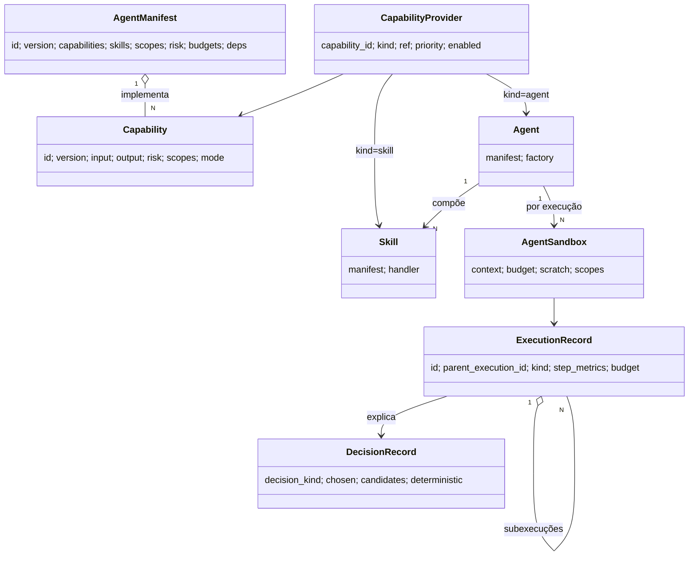
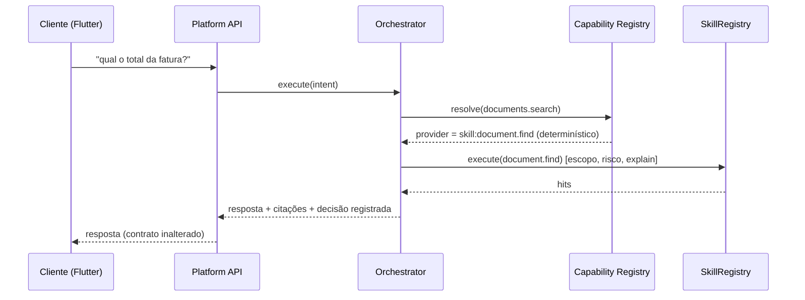

# 26 — Arquitetura da Camada de Agentes (Lumbra nativa para agentes)

> **Status: DESIGN. Nenhum código nesta fase.** Este é o pacote arquitetural
> que antecede a implementação. Complementa a análise (docs/25) e o A0 já
> entregue (ADR-053/054). Regra que atravessa tudo: **a Lumbra continua sendo
> a plataforma; agentes são consumidores dela, nunca a plataforma.** Não há
> novo Core, nem substituição de Skills, Memory, AI Gateway, Event Bus,
> Context Engine ou Explain Engine — só uma camada fina por cima.

---

## 0. Premissa e princípios inegociáveis

| Princípio | Como a camada de agentes o respeita |
|---|---|
| Single Core (ADR-042) | Agentes rodam DENTRO do Nó; não há segundo cérebro. |
| API First | Nenhum cliente conhece agentes; tudo pela Platform API. |
| Local First (ADR-002) | Agente local por padrão; nuvem é opt-in via AI Gateway. |
| Explainability First (ADR-023) | Toda decisão de orquestração vira Explanation rastreável. |
| Human-in-the-Loop (ADR-024/054) | Ação de risco de agente passa pela ApprovalPolicy. |
| Capability Driven (ADR-015/018) | Agentes descobrem competências, não implementações. |
| Identidade/Plugins (ADR-045/047) | Agente externo = plugin (cliente com escopo); um só modelo. |

**Não-objetivos declarados:** reescrever a plataforma; criar outro Core;
substituir componentes; usar LLM como primeira decisão; duplicar o sistema de
plugins; permitir memória oculta de agente.

---

## 1. Modelo conceitual: Skill × Capability × Agent

O ponto central do seu pedido: **abandonar "chamar agente pelo nome"** em
favor de **capacidades**. Três conceitos, sem sobreposição de responsabilidade:

| Conceito | O que é | Já existe? |
|---|---|---|
| **Skill** | A menor unidade EXECUTÁVEL. Handler tipado, com escopo, risco, explain, cancelamento. Ex.: `document.find` roda a busca híbrida. | ✅ `SkillRegistry` |
| **Capability** | Uma COMPETÊNCIA funcional roteável, com contrato tipado. Ex.: `documents.summarize`. Pode ser cumprida por 1 skill (fina) ou por 1 agente (composta). É uma INTERFACE, não uma implementação. | ❌ novo |
| **Agent** | Um PROVEDOR que implementa uma ou mais Capabilities, compondo Skills e (opcionalmente) delegando a outros agentes. | 🌓 contrato em A0 (`AgentManifest`); runtime a projetar |

Relação: **um Agent implementa N Capabilities; uma Capability usa N Skills; a
resolução Capability→Provider é dinâmica.** Skills não mudam. O que muda é que
passa a existir uma camada de competências acima delas.

```mermaid
graph TD
    Req[Requisição do usuário] --> ORQ[Orchestrator]
    ORQ -->|resolve| CAPREG[Capability Registry]
    CAPREG -->|capability -> provider| PROV{Provider}
    PROV -->|fina| SK1[Skill direta]
    PROV -->|composta| AG[Agent]
    AG --> AGREG[Agent Registry]
    AG -->|usa| SKILLS[SkillRegistry: document.find, memory.search...]
    AG -->|opcional| PLAN[Planner existente + PlanRunner]
    AG -->|delega| AG2[Outro Agent]
    subgraph Plataforma (inalterada)
        SKILLS --> CTX[Context Engine]
        SKILLS --> MEM[Memory / RAG / KG]
        SKILLS --> GW[AI Gateway]
        SKILLS --> BUS[Event Bus / Event Store]
    end
    ORQ -.decisões.-> DEC[Decision Engine -> ExplainPort]
    AG -.execução.-> TRK[ExecutionTracker: árvore]
```

### 1.1 Vocabulário de Capabilities (proposta inicial)

Namespaces `domínio.ação`, versionados. As competências que já têm skill
correspondente nascem "finas" (delegam direto); as demais nascem "compostas"
(um agente as implementa). Exemplo:

```
documents.search   documents.extract   documents.summarize
memory.search      memory.store        memory.consolidate
knowledge.query
calendar.create    calendar.search
finance.analyze    finance.forecast
health.monitor
automation.execute
```

Cada Capability declara: `id`, `version`, `input_schema`, `output_schema`,
`risk_level` mínimo, `required_scopes` mínimos, e se é `read`/`write`. O
contrato tipado é o que permite trocar o provedor sem quebrar o chamador.

---

## 2. Capability Registry (separado do Skill Registry)

Registro de **competências → provedores**, distinto do `SkillRegistry`
(que continua sendo o registro de unidades executáveis).

Responsabilidades: registrar capabilities e seus provedores; **resolver**
(capability → melhor provedor) de forma determinística; versionar; habilitar/
desabilitar; validar que o provedor declara os scopes/risk compatíveis com a
capability.

**Contrato (conceitual, não é código):**

```
CapabilitySpec:
  id: str                 # 'documents.summarize'
  version: str
  input_schema / output_schema
  risk_level: RiskLevel
  required_scopes: tuple[str]
  mode: read | write

CapabilityProvider:
  capability_id: str
  kind: skill | agent
  ref: str                # nome da skill OU id do agente
  priority: int           # desempate determinístico
  enabled: bool

CapabilityRegistryPort:
  register_capability(spec)
  register_provider(provider)
  resolve(capability_id, *, context) -> CapabilityProvider   # determinístico
  providers_of(capability_id) -> list[CapabilityProvider]
  set_enabled(provider, bool)
```

Regra de resolução (determinística, sem IA): filtra provedores habilitados e
com versão compatível → ordena por `priority` → aplica preferência de
privacidade (local antes de nuvem, herdando a política do AI Gateway) → devolve
o primeiro. Empate real vira Decision Engine + (no futuro) desempate por
histórico de qualidade. **A IA nunca escolhe o provedor por padrão.**

---

## 3. Agent Manifest (contrato completo)

Evolui o `AgentManifest` do A0 (`ports/agents.py`) para o conjunto que você
pediu. O A0 já tem: `id, version, description, provider, capabilities, tools,
required_scopes, risk_level, memory_access, delegation, limits`. Faltam:
`skills` explícitas, `token_budget`, `financial_budget`, `timeout`, `priority`,
`dependencies`, `approval_policy`, `events_consumed`, `events_published`.

**Contrato-alvo (conceitual):**

```
AgentManifest:
  id, version, description, provider
  capabilities: tuple[str]        # o que IMPLEMENTA (Capability ids)
  skills: tuple[str]              # skills que pode chamar (subconjunto do registry)
  required_scopes: tuple[str]     # TETO de permissão (efetivo = min(user, agent, delegação))
  risk_level: RiskLevel
  budgets:
     token_budget: int
     financial_budget_usd: float
     timeout_s: float
     max_steps, max_depth
  priority: int
  dependencies: tuple[str]        # capabilities/agentes de que depende
  approval_policy: inherit | strict | ...   # como o HITL se aplica a este agente
  memory_access: none | read
  events_consumed: tuple[str]     # tipos de evento do bus que reage
  events_published: tuple[str]    # tipos que emite (auditável)
```

Invariante de segurança (reforço do A0): **escopo efetivo em execução =
`min(usuário, required_scopes do agente, cadeia de delegação)`**; **risco
efetivo = `max(agente, skill, ação)`**. Um agente nunca amplia poder ao ser
chamado; delegação só estreita.

---

## 4. Agent Registry

Registro de agentes, espelhando o `SkillRegistry`, mas para provedores
compostos. Reusa o padrão (validação no registro, discovery, eventos).

Responsabilidades: descoberta dinâmica (por capability ou tag); versionamento
(N versões coexistem; resolução por compatibilidade); habilitar/desabilitar;
isolamento (um agente não enxerga o estado de outro); permissões (o registry é
onde o `required_scopes` do manifesto é fixado); **plugins** (um agente externo
se registra como cliente com escopo — ADR-047, sem segundo sistema); **hot
reload** (futuro: recarregar um agente sem derrubar o Nó — projetado agora,
implementado depois).

```
AgentRegistryPort:
  register(manifest, factory)
  get(agent_id, *, version=None) -> RegisteredAgent
  find(*, capability=None, tag=None) -> list[AgentManifest]
  set_enabled(agent_id, bool)
  versions(agent_id) -> list[str]
```

Relação com o Capability Registry: ao registrar um agente, o Agent Registry
publica automaticamente um `CapabilityProvider(kind=agent)` para cada
capability do manifesto. Uma fonte, dois índices.

---

## 5. Agent Lifecycle



Cada transição emite evento no Event Bus e Explanation. `Discarded` é sempre
o estado terminal: o sandbox (seção 8) e todo estado temporário somem;
persistência só sobrevive se aprovada.

---

## 6. Execution Tree (evolução do ExecutionTracker)

O `ExecutionTracker` já ganhou `parent_execution_id` (A0.1). Evoluir para uma
**árvore completa** com contabilidade por etapa:

- `parent_execution_id` ✅ (feito) — monta a árvore, herda `correlation_id`.
- **subexecuções**: cada skill/capability/delegação chamada por um agente é uma
  execução-filha rastreada (mesma correlação).
- **por etapa**: `duration_ms`, `cost_usd`, `tokens_in/out`, `explanation_ref`
  em cada nó (o `AICallRecord` do AI Gateway já mede custo/tokens; agregamos).
- **cancelamento em cascata**: cancelar um nó cancela a subárvore (o
  `CancellationToken` já é hierárquico via `.child()` — a base existe).

```
ExecutionRecord (evoluído):
  ... campos atuais + parent_execution_id ...
  step_metrics: list[StepMetric]     # tempo/custo/tokens/explain por etapa
  budget_spent: BudgetUsage          # tokens/USD/tempo acumulados na subárvore

ExecutionTreePort (consultas):
  tree(root_execution_id) -> ExecutionNode  # nó + filhos recursivos
  rollup(root) -> {duration_ms, cost_usd, tokens, steps}
```

O Developer Console (ADR-022) ganha uma visão de árvore; nada disso entra no
contrato público (a console fica fora do OpenAPI, como hoje).

---

## 7. Decision Engine

Você quer rastrear **decisões de orquestração**, com ou sem IA. Em vez de um
motor concorrente, o Decision Engine é uma **especialização do Explain Engine**
(não o substitui): um vocabulário estruturado de decisões, emitido pelo mesmo
`ExplainPort`, com um `kind` de decisão e os candidatos considerados.

```
DecisionRecord (uma Explanation especializada):
  decision_kind: capability_routing | provider_selection | planning
                 | fallback | model_selection | approval
  chosen: str                 # o que venceu
  candidates: list[{ref, score/reason}]   # o que perdeu, e por quê
  deterministic: bool         # true quando não envolveu IA
  correlation_id / parent_execution_id
```

Perguntas que passam a ter resposta: "por que este agente?", "por que esta
capability venceu?", "por que o Planner foi usado?", "por que houve fallback?",
"por que este modelo?". Tudo consultável em `/api/v1/dev/explanations` (já
existe), agora filtrável por `decision_kind`. **Reuso, não duplicação.**

---

## 8. Agent Sandbox

Ambiente isolado por EXECUÇÃO de agente. Não é contêiner de SO — é isolamento
lógico dentro do Nó (Local First): o agente não fala com bancos nem provedores
direto; tudo passa por portos com escopo reduzido.

```
AgentSandbox (por execução):
  context: AgentContext        # contexto próprio (via Context Engine, filtrado)
  budget: BudgetTracker        # tokens/USD/tempo próprios (debita a cada passo)
  scratch_memory: dict         # memória temporária (NÃO é a memória do usuário)
  scratch_files: TempDir       # arquivos temporários
  scopes: frozenset[str]       # permissões TEMPORÁRIAS = min(user, agent, delegação)
  cancellation: CancellationToken   # filho do token da execução
```

Ao finalizar (qualquer estado terminal): `scratch_memory` e `scratch_files`
são **descartados**; o `budget` vira métrica; a memória do usuário só é escrita
se o agente chamar uma skill `memory.store` explícita **e** a ApprovalPolicy
aprovar (fecha o problema visto no dogfooding: memória episódica guardando
resposta errada como fato). Nada de persistência silenciosa.

O sandbox é o ponto onde os invariantes de segurança são MATERIALIZADOS: o
`scopes` reduzido é o que o `SkillRegistry` vê ao checar permissão; um agente
com `memory:read` não consegue chamar `email:send` nem por delegação.

---

## 9. Orchestrator em camadas

Quatro camadas, IA por último. Cada camada só é acionada se a anterior não
resolveu — a Lumbra "sabe ser simples quando o problema é simples".

```mermaid
flowchart TD
    R[Requisição] --> L1{1. Regras determinísticas}
    L1 -->|resolve| X[Executa]
    L1 -->|não| L2{2. Capability Router}
    L2 -->|capability única resolve| X
    L2 -->|multi-passo| L3{3. Planner existente (KeywordPlanner + PlanRunner)}
    L3 -->|plano ok| X
    L3 -->|não sabe planejar| L4{4. LLM Planner (PlannerPort)}
    L4 --> X
    X --> DEC[Decision Engine registra a camada usada]
```

1. **Regras determinísticas**: atalhos explícitos (ex.: comando conhecido).
2. **Capability Router**: mapeia a intenção a UMA capability e resolve o
   provedor pelo Capability Registry. Cobre a maioria dos casos.
3. **Planner existente**: para objetivos multi-passo, o `KeywordPlanner` +
   `PlanRunner` (hoje dormentes) montam e executam um DAG de capabilities.
4. **LLM Planner**: só quando o determinístico não sabe — **atrás do mesmo
   `PlannerPort`**, sem tocar em nada acima. Registrado como decisão (por que a
   IA foi necessária).

Reuso máximo: o Orchestrator é fino; a inteligência de execução já mora no
PlanRunner e no SkillRegistry.

---

## 10. Compatibilidade (nada muda para os clientes)

- **Flutter / Desktop / Android / Web / Plugins**: inalterados. Continuam
  consumindo só a Platform API. Nenhum cliente referencia um agente.
- **API pública**: agentes entram como novos caminhos versionados (ex.:
  `POST /api/v1/agents/execute` ou reuso de `/chat` com roteamento interno),
  com a mesma disciplina de snapshot + teste de contrato. Um cliente pede uma
  CAPABILITY ou uma pergunta; nunca um agente por nome.
- **ADR-042/043/044/045/047**: preservados. Agente externo = plugin (cliente
  com escopo). Sync/identidade/topologia intactos. Mobile dispara e acompanha
  agentes pela API; a execução mora no Nó.

---

## 11. Modelo de domínio (novo, sobre o existente)



Entidades NOVAS: `Capability`, `CapabilityProvider`, `AgentSandbox`,
`DecisionRecord`. Entidades REUSADAS/estendidas: `AgentManifest` (A0),
`ExecutionRecord` (A0.1), `Skill`/`SkillRegistry`, `ExplainPort`, `PlannerPort`.

---

## 12. Diagramas de sequência

### 12.1 Pergunta simples (caminho determinístico, sem IA de orquestração)



### 12.2 Objetivo multi-agente com delegação (finanças)

```mermaid
sequenceDiagram
    participant ORQ as Orchestrator
    participant FA as finance-agent (sandbox, budget)
    participant DA as documents-capability
    participant MA as memory-capability
    participant TRK as ExecutionTracker (árvore)
    ORQ->>FA: finance.analyze (parent_execution=root)
    FA->>TRK: subexecução (herda correlação)
    FA->>DA: documents.search (escopo = min(user,agent))
    FA->>MA: memory.search
    par paralelo (Event Bus por chave)
        DA-->>FA: documentos
        MA-->>FA: memórias
    end
    FA->>FA: síntese (budget debitado por passo)
    FA-->>ORQ: resultado + explicação por etapa
    Note over FA: sandbox descartada; persistência só se aprovada
```

---

## 13. Contratos das novas interfaces (resumo)

Portos NOVOS (só assinatura conceitual): `CapabilityRegistryPort`,
`AgentRegistryPort`, `ExecutionTreePort`, `AgentSandbox` (fábrica),
`OrchestratorPort`. Portos REUSADOS sem alteração: `SkillRegistry`,
`PlannerPort`, `ApprovalPolicyPort` (A0.2), `ExplainPort`, `AIGatewayPort`,
`ContextProviderPort`, `PermissionPort`, `MemoryStorePort`, `SearchPort`,
`KnowledgeGraphPort`. (Detalhe de cada assinatura vem no ADR/incremento
correspondente, para não congelar decisão antes da hora.)

---

## 14. ADRs propostos (registrados em docs/20)

| ADR | Título | Fecha qual pergunta |
|---|---|---|
| ADR-055 | Capability Model — competências roteáveis, distintas de skills | 1 |
| ADR-056 | Capability Registry — resolução determinística capability→provider | 2 |
| ADR-057 | Agent Registry — descoberta, versionamento, isolamento, plugin-como-agente | 4 |
| ADR-058 | Agent Lifecycle — estados e transições auditáveis | 5 |
| ADR-059 | Execution Tree — árvore com custo/tokens/tempo/explicação por etapa e cancelamento em cascata | 6 |
| ADR-060 | Decision Engine — decisões de orquestração via ExplainPort (não o substitui) | 7 |
| ADR-061 | Agent Sandbox — isolamento, budgets e estado temporário descartável | 8 |
| ADR-062 | Orchestrator em camadas — determinístico → capability → planner → LLM | 9 |

(O AgentManifest completo evolui o ADR-053; a aprovação/HITL é o ADR-054, já
aceito.) As entradas concisas ficam em `docs/20-adrs.md` com status 🔷 —
**decisão de design, implementação incremental pendente de sua aprovação por
etapa.**

---

## 15. Alternativas descartadas

- **Novo Core/runtime de agentes paralelo** — duplicaria orquestração, plugins,
  memória; viola Single Core. Rejeitado (é a decisão central).
- **Agente chamado pelo nome** — acopla o cliente à implementação; substituído
  pelo Capability Model (seu pedido).
- **LLM como orquestrador central** — custo, latência, imprevisibilidade,
  difícil de testar/depurar/rodar offline; vira a 4ª camada, não a 1ª.
- **Decision Engine como motor separado** — duplicaria o Explain; vira uma
  especialização do ExplainPort.
- **Sandbox como contêiner de SO** — pesado e contra Local First; isolamento
  lógico por escopo/budget resolve sem essa complexidade.
- **Capability Registry fundido no Skill Registry** — misturaria "unidade
  executável" com "competência roteável"; mantidos separados, uma fonte
  alimentando dois índices.

---

## 16. Riscos e mitigações

| Risco | Mitigação |
|---|---|
| Explosão de chamadas LLM (multiagente caro) | Budgets no manifesto + BudgetTracker no sandbox + orquestração determinística-primeiro; early termination. |
| Loops de delegação (A→B→A) | `max_depth`, `visited set`, budgets, `parent_execution_id`; delegação só estreita escopo. |
| Escalada de privilégio via delegação | Escopo efetivo = min(cadeia); reavaliado a cada salto no SkillRegistry. |
| Vazamento de dados local_only via agente/tool cloud | Propagação de privacidade do AI Gateway estendida à delegação; sandbox carrega o modo de privacidade. |
| Memória oculta / fatos errados persistidos | `memory_access` read|none; escrita só por skill explícita + ApprovalPolicy (lição do dogfooding da fatura). |
| Complexidade que trava testes | Cada incremento pequeno, testável, com AI Gateway mockado e golden set de agentes no CI. |
| Regressão no que já funciona | Camada aditiva; nada substitui componentes; CI verde por incremento; reversível. |

---

## 17. Impacto no roadmap (docs/13)

A fase de agentes vira uma **trilha evolutiva** (não um épico monolítico),
alinhada ao A0 já entregue. Atualização proposta para docs/13: mover "Agent
Runtime" de futuro para "em evolução incremental (A0 entregue)".

---

## 18. Plano incremental (pequeno, independente, testável, reversível, CI verde)

Cada incremento é aprovável isoladamente e não quebra os clientes.

- **A0 — Contratos base** ✅ *(entregue)*: `AgentManifest` (seed),
  `ApprovalPolicyPort` + gate default-permitir, `parent_execution_id`.
- **A1 — Capability Model + Registry**: `CapabilitySpec`, `CapabilityProvider`,
  `CapabilityRegistry` (resolução determinística). Skills existentes viram
  provedores "finos" de capabilities equivalentes. Sem agentes ainda. Testes de
  resolução/versionamento/enable. Reversível (registry isolado).
- **A2 — Agent Registry + agente trivial**: registrar/descobrir/versionar
  agentes; um agente que implementa 1 capability compondo 1 skill (prova de
  conceito). Publica CapabilityProvider(kind=agent).
- **A3 — Execution Tree**: `step_metrics` + `budget_spent` + rollup +
  cancelamento em cascata; visão de árvore no Developer Console. Constrói sobre
  A0.1.
- **A4 — Decision Engine**: `decision_kind` + candidatos no ExplainPort; filtro
  em `/dev/explanations`. Sem novo motor.
- **A5 — Orchestrator em camadas (1–3)**: regras determinísticas + Capability
  Router + liga o Planner/PlanRunner dormentes. Rota na Platform API
  (contrato + snapshot). LLM Planner (camada 4) fica desligado por padrão.
- **A6 — Agent Sandbox**: isolamento por execução (contexto/budget/scratch/
  scopes) + descarte + persistência só via aprovação.
- **A7 — Primeiro agente especialista** (documents ou finance) compondo
  capabilities; **golden set de agentes** no CI (replay determinístico, AI
  Gateway mockado, testes de permissão/cancelamento/falha).
- **A8 — Delegação agente→agente**: escopo intersectado, `max_depth`/`visited`/
  budget, propagação de privacidade; testes adversariais de escalada.
- **A9 — LLM Planner (camada 4)** e **A10 — Integração mobile** (disparo/
  acompanhamento de agentes pelo Android via contrato).

Critério de saída de cada incremento: CI verde (quality/tests/integration/
dart-client/flutter-app/docker), zero regressão nos clientes, ADR aceito,
reversível por `git revert`.

---

## 19. Resposta às 10 perguntas (mapa rápido)

1. Capability Model → seção 1 (Skill×Capability×Agent) + ADR-055.
2. Capability Registry → seção 2 + ADR-056.
3. Agent Manifest → seção 3 (evolui ADR-053).
4. Agent Registry → seção 4 + ADR-057.
5. Agent Lifecycle → seção 5 + ADR-058.
6. Execution Tree → seção 6 + ADR-059 (base A0.1 pronta).
7. Decision Engine → seção 7 + ADR-060.
8. Agent Sandbox → seção 8 + ADR-061.
9. Orchestrator → seção 9 + ADR-062.
10. Compatibilidade → seção 10 (clientes e ADR-042/043/044/045/047 intactos).

**Conclusão:** a camada de agentes cabe inteira sobre a plataforma atual como
evolução aditiva. O maior "trabalho" é conceitual (Capability como competência
roteável) e de fiação (acordar Planner/PlanRunner, montar a árvore de execução).
Nada é reescrita; tudo é reversível e testável por partes.
